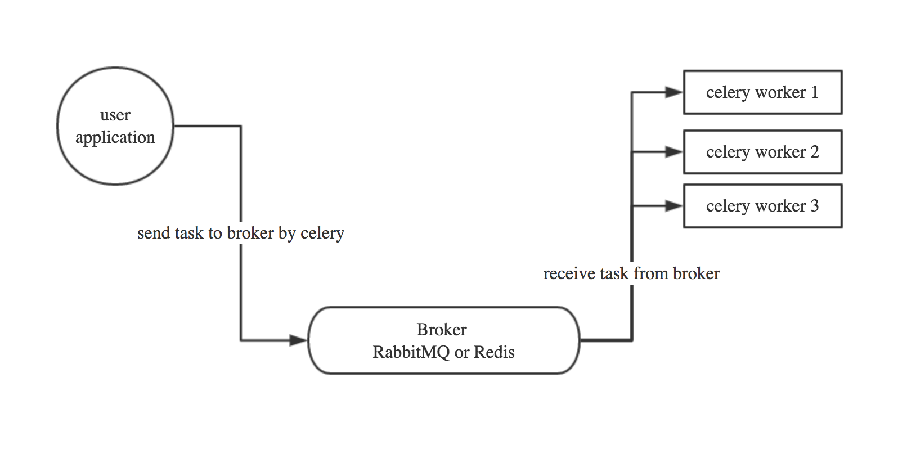
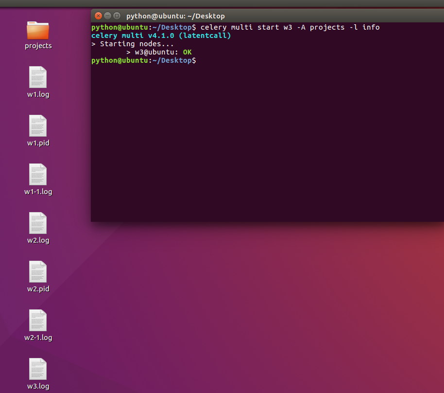
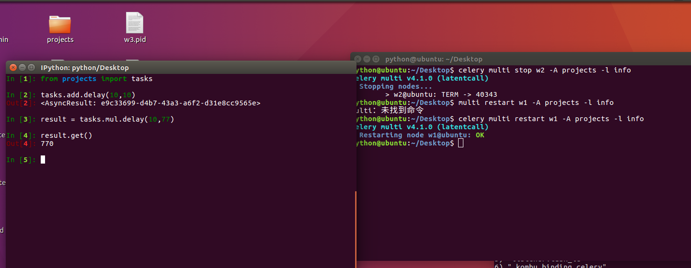

[celery快速入门博客](https://www.cnblogs.com/alex3714/p/6351797.html)

本节内容

Celery介绍和基本使用

在项目中如何使用celery

启用多个workers

Celery 定时任务

与django结合

通过django配置celery periodic task


### 一、Celery介绍和基本使用 

Celery 是一个 基于python开发的分布式异步消息任务队列，通过它可以轻松的实现任务的异步处理， 如果你的业务场景中需要用到异步任务，就可以考虑使用celery， 举几个实例场景中可用的例子:

1. 你想对100台机器执行一条批量命令，可能会花很长时间 ，但你不想让你的程序等着结果返回，而是给你返回 一个任务ID,你过一段时间只需要拿着这个任务id就可以拿到任务执行结果， 在任务执行ing进行时，你可以继续做其它的事情。 
2. 你想做一个定时任务，比如每天检测一下你们所有客户的资料，如果发现今天 是客户的生日，就给他发个短信祝福


Celery 在执行任务时需要通过一个消息中间件来接收和发送任务消息，以及存储任务结果， 一般使用rabbitMQ or Redis

**1.1 Celery有以下优点：**

1. 简单：一单熟悉了celery的工作流程后，配置和使用还是比较简单的
2. 高可用：当任务执行失败或执行过程中发生连接中断，celery 会自动尝试重新执行任务
3. 快速：一个单进程的celery每分钟可处理上百万个任务
4. 灵活： 几乎celery的各个组件都可以被扩展及自定制


Celery基本工作流程图



#### 1.2 Celery安装使用

Celery的默认broker是RabbitMQ, 仅需配置一行就可以

rabbitMQ 没装的话请装一下，安装看这里  http://docs.celeryproject.org/en/latest/getting-started/brokers/rabbitmq.html#id3


**使用Redis做broker也可以**

`$ pip install -U "celery[redis]"`


配置

```
broker存放任务,
backend存放结果,
```


Configuration is easy, just configure the location of your Redis database:

```
app.conf.broker_url = 'redis://localhost:6379/0'
```

Where the URL is in the format of:

```
redis://:password@hostname:port/db_number

```

all fields after the scheme are optional, and will default to `localhost` on port 6379, using database 0.


如果想获取每个任务的执行结果，还需要配置一下把任务结果存在哪

```
app.conf.result_backend = 'redis://localhost:6379/0'
```


#### 1. 3 开始使用Celery啦　　

#### 安装celery模块

`$ pip install celery`

写task.py任务

**创建一个celery application 用来定义你的任务列表**

**启动Celery Worker来开始监听并执行任务**

```bash
$ celery -A tasks worker --loglevel=info
# 在windows上使用需要
pip install eventlet -> celery -A your_app_name worker --pool=eventlet
# 注意是tasks 不是tasks.py worker代表工作身份是worker
```

**调用任务**

再打开一个终端， 进行命令行模式，调用任务

(先要启动redis)

```
$ cd 到tasks所在目录下
$ ipyhton
>>> from tasks import add
>>> add.delay(4, 4)
<AsyncResult: 9c281691-58ef-43a1-931e-843a2e6089c6>
```

此时redis数据库中

```
127.0.0.1:6379[5]> select 3
OK
127.0.0.1:6379[3]> keys *
1) "_kombu.binding.celery"
2) "celery"
127.0.0.1:6379[3]>
```


看你的worker终端会显示收到 一个任务，此时你想看任务结果的话，需要在调用 任务时　赋值个变量

```python
>>> result = add.delay(4, 4)
```

```python
In [17]: result = add.delay(4,4)

In [18]: result.status
Out[18]: 'SUCCESS'

In [19]: result.get()
Out[19]: 8
```


The [`ready()`](http://docs.celeryproject.org/en/latest/reference/celery.result.html#celery.result.AsyncResult.ready) method returns whether the task has finished processing or not:

result.ready()会返回值,无论tasks有没有完成.没完成返回False,完成则返回True.


You can wait for the result to complete, but this is rarely used since it turns the asynchronous call into a synchronous one:

你可以等待,直到任务执行完毕,但是这很少使用,因为这把一个异步任务变成同步了.(使用celery没意义了)

设置timeout参数,过了1秒没返回值会直接触发异常,提示

TimeoutError: The operation timed out.

```
>>> result.get(timeout=1)
8
```


In case the task raised an exception, [`get()`](http://docs.celeryproject.org/en/latest/reference/celery.result.html#celery.result.AsyncResult.get) will re-raise the exception, but you can override this by specifying the `propagate` argument:

有时候任务发送异常,get()方法同样也会raise一个异常,但是你可以添加propagate参数

```
>>> result.get(propagate=False)
这样任务就不会触发一个异常了
比如说除法,除数为0,会返回
celery.backends.base.ZeroDivisionError('division by zero')
```

If the task raised an exception you can also gain access to the original traceback:

```
>>> result.traceback
这个变量保存异常的信息,可以写入日志

'Traceback (most recent call last):\n  File "c:\\python36\\lib\\site-packages\\celery\\app\\trace.py", line 368, in trace_task\n    R = retval = fun(*args, **kwargs)\n  File "c:\\python36\\lib\\site-packages\\celery\\app\\trace.py", line 623, in __protected_call__\n    return self.run(*args, **kwargs)\n  File "C:\\Users\\Avalon\\Desktop\\Python学习\\python\\celery使用\\tasks.py", lin
e 18, in chufa\n    return x/y\nZeroDivisionError: division by zero\n'
```


### 二、在项目中如何使用celery　

可以把celery配置成一个应用

目录格式如下

> proj/__ init __py
>
> ​	/celery.py
>
> ​	/tasks.py

#### `proj/celery.py内容`

```python
from __future__ import absolute_import, unicode_literals
from celery import Celery
 
app = Celery('proj',
             broker='amqp://',
             backend='amqp://',
             include=['proj.tasks'])
 
# Optional configuration, see the application user guide.
app.conf.update(
    result_expires=3600,
)
 
if __name__ == '__main__':
    app.start()
```

#### `proj/tasks.py中的内容`

```python
from __future__ import absolute_import, unicode_literals
from .celery import app


@app.task
def add(x, y):
    return x + y


@app.task
def mul(x, y):
    return x * y


@app.task
def xsum(numbers):
    return sum(numbers)
```

### 启动worker 

`$ celery -A proj worker -l info`

```powershell
windows下测试
C:\Users\Avalon\Desktop\Python学习\python\celery使用\项目中使用celery
 celery -A projects worker --pool=eventlet
 # 在项目文件夹外执行
```

### 任务发送

```
cd C:\Users\Avalon\Desktop\Python学习\python\celery使用\项目中使用celery\
ipython
# 注意ipython 要在项目目录外打开
```

```
 from projects import tasks
 result = tasks.add.delay(10,10)
 result.get()
 
```


### 后台启动worker #只能linux下测试

#### In the background

In production you’ll want to run the worker in the background, this is described in detail in the [daemonization tutorial](http://docs.celeryproject.org/en/latest/userguide/daemonizing.html#daemonizing).

The daemonization scripts uses the **celery multi** command to start one or more workers in the background:

```
# 使用multi命令 进行后台启动,w1为worker的名字 proj是项目文件夹的名字
$ celery multi start w1 -A proj -l info
celery multi v4.0.0 (latentcall)
> Starting nodes...
    > w1.halcyon.local: OK
```



You can restart it too:(重启这个celery)

```
$ celery  multi restart w1 -A proj -l info
celery multi v4.0.0 (latentcall)
> Stopping nodes...
    > w1.halcyon.local: TERM -> 64024
> Waiting for 1 node.....
    > w1.halcyon.local: OK
> Restarting node w1.halcyon.local: OK
celery multi v4.0.0 (latentcall)
> Stopping nodes...
    > w1.halcyon.local: TERM -> 64052
```

or stop it:

```
$ celery multi stop w1 -A proj -l info
```

The `stop` command is asynchronous so it won’t wait for the worker to shutdown. You’ll probably want to use the `stopwait` command instead, this ensures all currently executing tasks is completed before exiting:

stop会立刻停止,建议使用stopwait,直到现在执行的任务结束后才停止.

```
$ celery multi stopwait w1 -A proj -l info
```




### 三、Celery 定时任务


 celery支持定时任务，设定好任务的执行时间，celery就会定时自动帮你执行， 这个定时任务模块叫celery beat


写一个脚本 叫periodic_task.py

```python
from celery import Celery
from celery.schedules import crontab
 
app = Celery()
 
@app.on_after_configure.connect
def setup_periodic_tasks(sender, **kwargs):
    # Calls test('hello') every 10 seconds.
    sender.add_periodic_task(10.0, test.s('hello'), name='add every 10')
 
    # Calls test('world') every 30 seconds
    sender.add_periodic_task(30.0, test.s('world'), expires=10)
 
    # Executes every Monday morning at 7:30 a.m.
    sender.add_periodic_task(
        crontab(hour=7, minute=30, day_of_week='sun'),
        test.s('Happy Mondays!'),
    )
 
@app.task
def test(arg):
    print(arg)
```

任务添加好了，需要让celery单独启动一个进程来定时发起这些任务， 注意， 这里是发起任务，不是执行，这个进程只会不断的去检查你的任务计划， 每发现有任务需要执行了，就发起一个任务调用消息，交给celery worker去执行


**启动任务调度器 celery beat**


`$ celery -A periodic_task beat`


输出like below


**启动celery worker来执行任务**

```
$ celery -A periodic_task worker
```

```
输出如下
LocalTime -> 2017-12-23 23:34:17
Configuration ->
    . broker -> redis://127.0.0.1:6379/3
    . loader -> celery.loaders.app.AppLoader
    . scheduler -> celery.beat.PersistentScheduler
    . db -> celerybeat-schedule
    . logfile -> [stderr]@%WARNING
    . maxinterval -> 5.00 minutes (300s)
```


**启动celery worker来执行任务**

```
$ celery -A periodic_task worker
```


注意：Beat needs to store the last run times of the tasks in a local database file (named celerybeat-schedule by default), so it needs access to write in the current directory, or alternatively you can specify a custom location for this file:

Beats需要一个地方来存储日志,数据

```
$ celery -A periodic_task beat -s /home/celery/var/run/celerybeat-schedule
# 后面跟路径,来指定存储日志和数据的地方
```

#### 更复杂的定时配置　　

还有更多定时配置方式如下：

| **Example**                              | **Meaning**                              |
| ---------------------------------------- | ---------------------------------------- |
| `crontab()`                              | Execute every minute.                    |
| `crontab(minute=0, hour=0)`              | Execute daily at midnight.               |
| `crontab(minute=0, hour='*/3')`          | Execute every three hours: midnight, 3am, 6am, 9am, noon, 3pm, 6pm, 9pm. |
| `crontab(minute=0,``hour='0,3,6,9,12,15,18,21')` | Same as previous.                        |
| `crontab(minute='*/15')`                 | Execute every 15 minutes.                |
| `crontab(day_of_week='sunday')`          | Execute every minute (!) at Sundays.     |
| `crontab(minute='*',``hour='*',``day_of_week='sun')` | Same as previous.                        |
| `crontab(minute='*/10',``hour='3,17,22',``day_of_week='thu,fri')` | Execute every ten minutes, but only between 3-4 am, 5-6 pm, and 10-11 pm on Thursdays or Fridays. |
| `crontab(minute=0,hour='*/2,*/3')`       | Execute every even hour, and every hour divisible by three. This means: at every hour *except*: 1am, 5am, 7am, 11am, 1pm, 5pm, 7pm, 11pm |
| `crontab(minute=0, hour='*/5')`          | Execute hour divisible by 5. This means that it is triggered at 3pm, not 5pm (since 3pm equals the 24-hour clock value of “15”, which is divisible by 5). |
| `crontab(minute=0, hour='*/3,8-17')`     | Execute every hour divisible by 3, and every hour during office hours (8am-5pm). |
| `crontab(0, 0,day_of_month='2')`         | Execute on the second day of every month. |
| `crontab(0, 0,``day_of_month='2-30/3')`  | Execute on every even numbered day.      |
| `crontab(0, 0,``day_of_month='1-7,15-21')` | Execute on the first and third weeks of the month. |
| `crontab(0, 0,day_of_month='11',``month_of_year='5')` | Execute on the eleventh of May every year. |
| `crontab(0, 0,``month_of_year='*/3')`    | Execute on the first month of every quarter. |

 

上面能满足你绝大多数定时任务需求了，甚至还能根据潮起潮落来配置定时任务， 具体看 http://docs.celeryproject.org/en/latest/userguide/periodic-tasks.html#solar-schedules 


上面的定时任务比较简单，只是每多少s执行一个任务，但如果你想要每周一三五的早上8点给你发邮件怎么办呢？哈，其实也简单，用crontab功能，跟linux自带的crontab功能是一样的，可以个性化定制任务执行时间


[linux crontab]( http://www.cnblogs.com/peida/archive/2013/01/08/2850483.html)

注释设置时区

```
CELERY_TIMEZONE = 'Asia/Shanghai'
```


