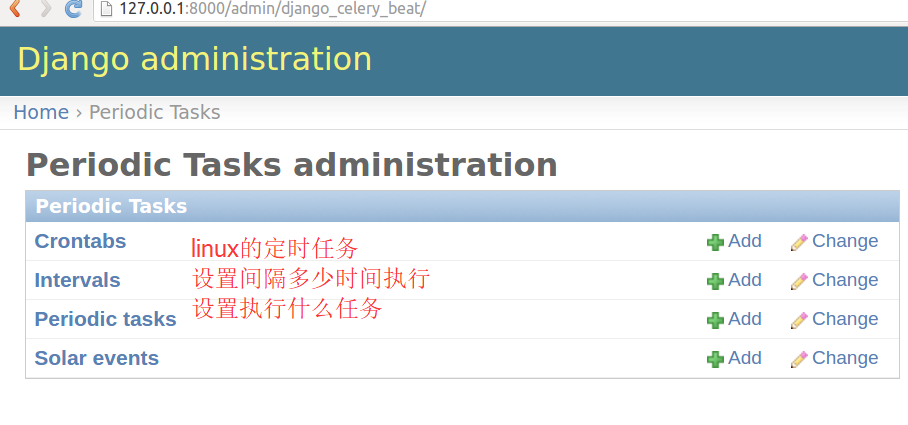
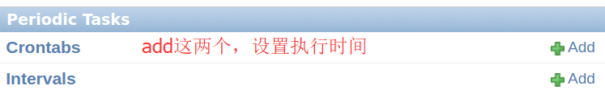
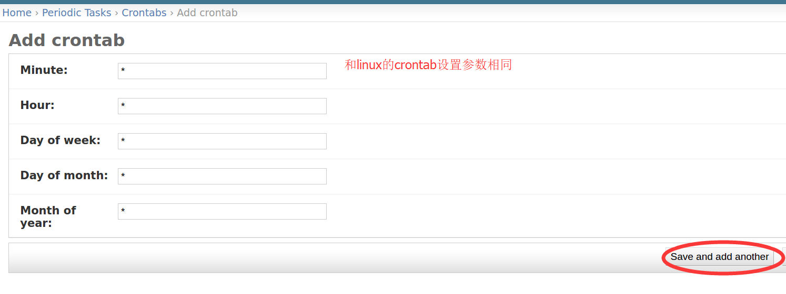
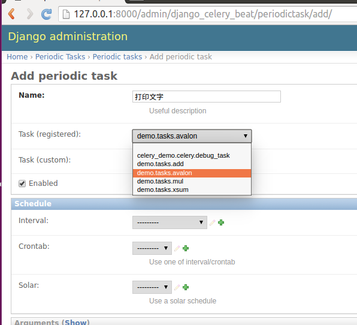
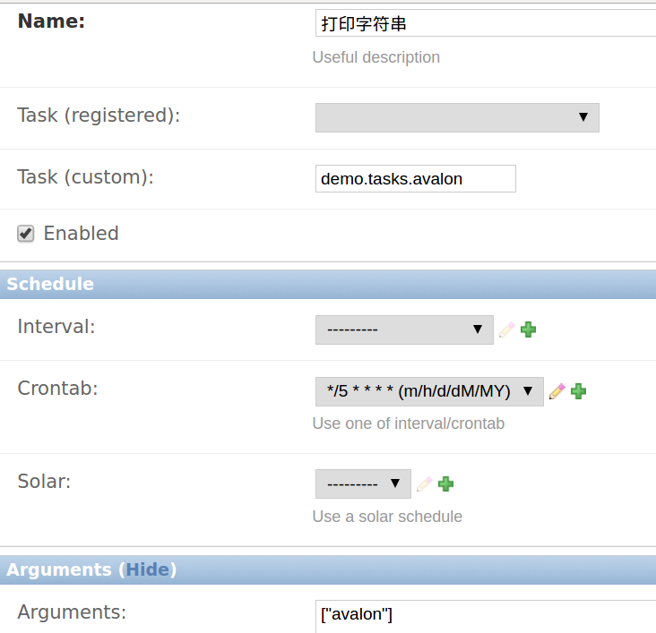
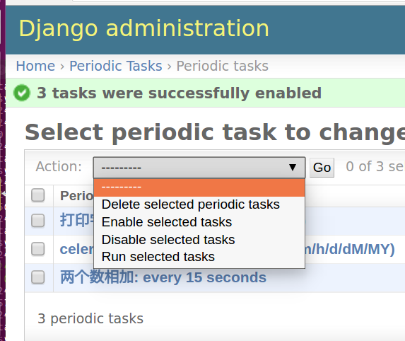

下面配置完之后 进入项目所在目录,运行命令启动celery

```
celery -A 项目名 worker -l info
# 我的项目文件夹名字为celery_demo
celery -A celery_demo worker -l info
```


四、最佳实践之与django结合 

django 可以轻松跟celery结合实现异步任务，只需简单配置即可

If you have a modern Django project layout like:

```
- proj/
  - proj/__init__.py
  - proj/settings.py
  - proj/urls.py
- manage.py

```

then the recommended way is to create a new proj/proj/celery.py module that defines the Celery instance:

**file:** *proj/proj/celery.py　　*

Then you need to import this app in your `proj/proj/__init__.py` module. This ensures that the app is loaded when Django starts so that the `@shared_task` decorator (mentioned later) will use it:　　

`proj/proj/__init__.py:`

Note that this example project layout is suitable for larger projects, for simple projects you may use a single contained module that defines both the app and tasks, like in the [First Steps with Celery](http://docs.celeryproject.org/en/latest/getting-started/first-steps-with-celery.html#tut-celery) tutorial.　　

`Let’s break down what happens in the first module, first we import absolute imports from the future, so that our celery.py module won’t clash with the library:`

Then we set the default [`DJANGO_SETTINGS_MODULE`](http://django.readthedocs.io/en/latest/topics/settings.html#envvar-DJANGO_SETTINGS_MODULE) environment variable for the **celery** command-line program:

You don’t need this line, but it saves you from always passing in the settings module to the `celery` program. It must always come before creating the app instances, as is what we do next:

This is our instance of the library.

 

We also add the Django settings module as a configuration source for Celery. This means that you don’t have to use multiple configuration files, and instead configure Celery directly from the Django settings; but you can also separate them if wanted.

The uppercase name-space means that all Celery configuration options must be specified in uppercase instead of lowercase, and start with `CELERY_`, so for example the `task_always_eager`` setting becomes `CELERY_TASK_ALWAYS_EAGER`, and the [`broker_url`](http://docs.celeryproject.org/en/latest/userguide/configuration.html#std:setting-broker_url) setting becomes `CELERY_BROKER_URL`.

You can pass the object directly here, but using a string is better since then the worker doesn’t have to serialize the object.

Next, a common practice for reusable apps is to define all tasks in a separate `tasks.py`module, and Celery does have a way to  auto-discover these modules:

With the line above Celery will automatically discover tasks from all of your installed apps, following the `tasks.py` convention:

Finally, the `debug_task` example is a task that dumps its own request information. This is using the new `bind=True` task option introduced in Celery 3.1 to easily refer to the current task instance.

**然后在具体的app里的tasks.py里写你的任务**

 

 

**在你的django views里调用celery task**

```
from django.shortcuts import render,HttpResponse
 
# Create your views here.
 
from  bernard import tasks
 
def task_test(request):
 
    res = tasks.add.delay(228,24)
    print("start running task")
    print("async task res",res.get() )
 
    return HttpResponse('res %s'%res.get())
```


### 五、在django中使用计划任务功能　　


There’s  the [django-celery-beat](https://pypi.python.org/pypi/django-celery-beat/) extension that stores the schedule in the Django database, and presents a convenient admin interface to manage periodic tasks at runtime.

To install and use this extension:

1. Use **pip** to install the package:

   > ```
   > $ pip install django-celery-beat
   >
   > ```

2. Add the `django_celery_beat` module to `INSTALLED_APPS` in your Django project’ `settings.py`:

   ```
       INSTALLED_APPS = (
           ...,
           'django_celery_beat',
       )

   Note that there is no dash in the module name, only underscores.

   ```

3. Apply Django database migrations so that the necessary tables are created:

   > ```
   > $ python manage.py migrate
   >
   > ```

4. Start the **celery beat** service using the `django` scheduler:

   > ```
   > $ celery -A proj beat -l info -S django
   >
   > ```

5. Visit the Django-Admin interface to set up some periodic tasks.


```shell
三个命令
celery -A celery_demo worker #启动celery worker
python manage.py runserver # 启动django调试服务器
celery -A celery_demo beat -l info -S django #启动任务调度器
```

### 修改任务之后要重启beat调度器,不然没效果







点击 Periodic tasks add设置定时任务执行

所有tasks.py中的任务会自动添加进来




### 传入参数要是json格式的




# 任务保存后执行 enable task

