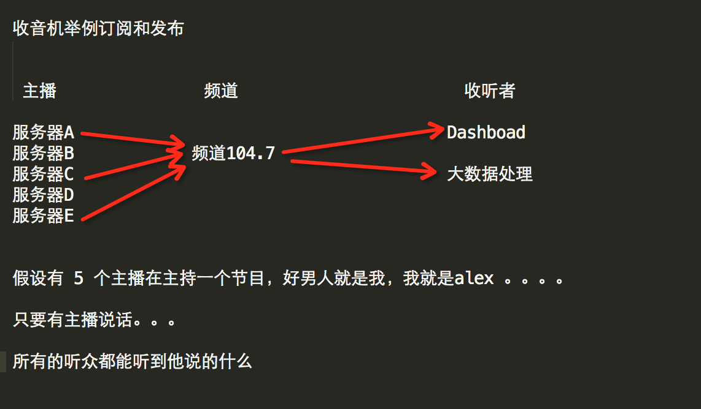

### 发布订阅




发布者：服务器

订阅者：Dashboad和数据处理

Demo如下：

[](javascript:void(0);)

```python
#!/usr/bin/env python
# -*- coding:utf-8 -*-

import redis


class RedisHelper:

    def __init__(self):
        self.__conn = redis.Redis(host='10.211.55.4')
        self.chan_sub = 'fm104.5'
        self.chan_pub = 'fm104.5'

    def public(self, msg):
        self.__conn.publish(self.chan_pub, msg)
        return True

    def subscribe(self):
        pub = self.__conn.pubsub()
        pub.subscribe(self.chan_sub)
        pub.parse_response()
        return pub
```

[](javascript:void(0);)

订阅者：

[](javascript:void(0);)

```python
#!/usr/bin/env python
# -*- coding:utf-8 -*-
 
from monitor.RedisHelper import RedisHelper
 
obj = RedisHelper()
redis_sub = obj.subscribe()
 
while True:
    msg= redis_sub.parse_response()
    print msg
```

[](javascript:void(0);)

发布者：

[](javascript:void(0);)

```python
#!/usr/bin/env python
# -*- coding:utf-8 -*-
 
from monitor.RedisHelper import RedisHelper
 
obj = RedisHelper()
obj.public('hello')
```

[](javascript:void(0);)

更多参见：https://github.com/andymccurdy/redis-py/

http://doc.redisfans.com/