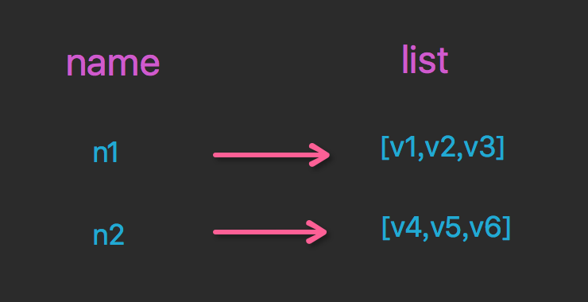

### List操作，redis中的List在在内存中按照一个name对个List来存储。



lpush(name,values)

[](javascript:void(0);)

```
# 在name对应的list中添加元素，每个新的元素都添加到列表的最左边
 
# 如：
    # r.lpush('oo', 11,22,33)
    # 保存顺序为: 33,22,11
 
# 扩展：
    # rpush(name, values) 表示从右向左操作
```


lpushx(name,value)

```
# 在name对应的list中添加元素，只有name已经存在时，值添加到列表的最左边
 
# 更多：
    # rpushx(name, value) 表示从右向左操作
```

llen(name)

```
# name对应的list元素的个数
```


linsert(name, where, refvalue, value))

[](javascript:void(0);)

```
# 在name对应的列表的某一个值前或后插入一个新值
 
# 参数：
    # name，redis的name
    # where，BEFORE或AFTER
    # refvalue，标杆值，即：在它前后插入数据
    # value，要插入的数据
```

[](javascript:void(0);)

r.lset(name, index, value)

```
# 对name对应的list中的某一个索引位置重新赋值
 
# 参数：
    # name，redis的name
    # index，list的索引位置
    # value，要设置的值
```

r.lrem(name, value, num)

[](javascript:void(0);)

```
# 在name对应的list中删除指定的值
 
# 参数：
    # name，redis的name
    # value，要删除的值
    # num，  num=0，删除列表中所有的指定值；
           # num=2,从前到后，删除2个；
           # num=-2,从后向前，删除2个
```

[](javascript:void(0);)

lpop(name)

```
# 在name对应的列表的左侧获取第一个元素并在列表中移除，返回值则是第一个元素
 
# 更多：
    # rpop(name) 表示从右向左操作
```

lindex(name, index)

```
#在name对应的列表中根据索引获取列表元素
```

lrange(name, start, end)

```
# 在name对应的列表分片获取数据
# 参数：
    # name，redis的name
    # start，索引的起始位置
    # end，索引结束位置
```

ltrim(name, start, end)

```
# 在name对应的列表中移除没有在start-end索引之间的值
# 参数：
    # name，redis的name
    # start，索引的起始位置
    # end，索引结束位置
```

rpoplpush(src, dst)

```
# 从一个列表取出最右边的元素，同时将其添加至另一个列表的最左边
# 参数：
    # src，要取数据的列表的name
    # dst，要添加数据的列表的name
```

blpop(keys, timeout)

[](javascript:void(0);)

```
# 将多个列表排列，按照从左到右去pop对应列表的元素
 
# 参数：
    # keys，redis的name的集合
    # timeout，超时时间，当元素所有列表的元素获取完之后，阻塞等待列表内有数据的时间（秒）, 0 表示永远阻塞
 
# 更多：
    # r.brpop(keys, timeout)，从右向左获取数据
```

[](javascript:void(0);)

brpoplpush(src, dst, timeout=0)

```
# 从一个列表的右侧移除一个元素并将其添加到另一个列表的左侧
 
# 参数：
    # src，取出并要移除元素的列表对应的name
    # dst，要插入元素的列表对应的name
    # timeout，当src对应的列表中没有数据时，阻塞等待其有数据的超时时间（秒），0 表示永远阻塞
```

自定义增量迭代


```python
# 由于redis类库中没有提供对列表元素的增量迭代，如果想要循环name对应的列表的所有元素，那么就需要：
    # 1、获取name对应的所有列表
    # 2、循环列表
# 但是，如果列表非常大，那么就有可能在第一步时就将程序的内容撑爆，所有有必要自定义一个增量迭代的功能：
 
def list_iter(name):
    """
    自定义redis列表增量迭代
    :param name: redis中的name，即：迭代name对应的列表
    :return: yield 返回 列表元素
    """
    list_count = r.llen(name)
    for index in xrange(list_count):
        yield r.lindex(name, index)
 
# 使用
for item in list_iter('pp'):
    print item
```