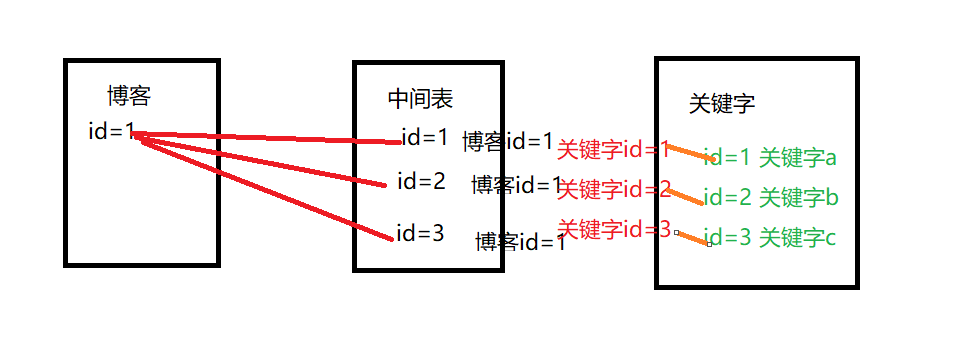

## 一对多

最常见就是一对多

存在User表和Email_address表.

每个用户对应多个Email地址.典型的一对多

将User表的id作为外键,约束Address表

设置Address表中字段

User_id Foreignerkey=User.id

#### 外键放在一对多的多所在的表

### 多对多

博客中有博文表和关键字表

每个博客对应多个关键字

每个关键字对应多个博客

通过中间表实现多对多

### 一对一

一对一是特殊的一对多,即作为约束的外键只有一行.

两个表之间的行与行一一对应	

则两张表就像变成一张表一样