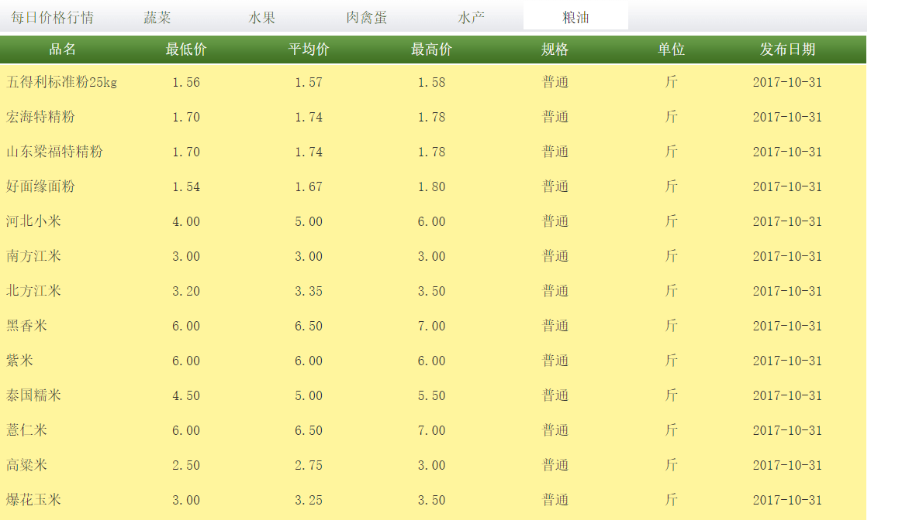

父元素xpath:

```
//div[@class='hangq_left']//tr[position()>1]
```




## 品名字段

//div[@class='hangq_left']//tbody/tr[position()>1]//td[position()=1]


## 最低价字段

//div[@class='hangq_left']//tbody/tr[position()>1]//td[position()=2]


### 平均价字段

//div[@class='hangq_left']//tbody/tr[position()>1]//td[position()=3]


### 最高价字段

//div[@class='hangq_left']//tbody/tr[position()>1]//td[position()=4]


### 规格字段

//div[@class='hangq_left']//tbody/tr[position()>1]//td[position()=5]


### 单位字段

//div[@class='hangq_left']//tbody/tr[position()>1]//td[position()=6]


### 日期字段

//div[@class='hangq_left']//tbody/tr[position()>1]//td[position()=7]