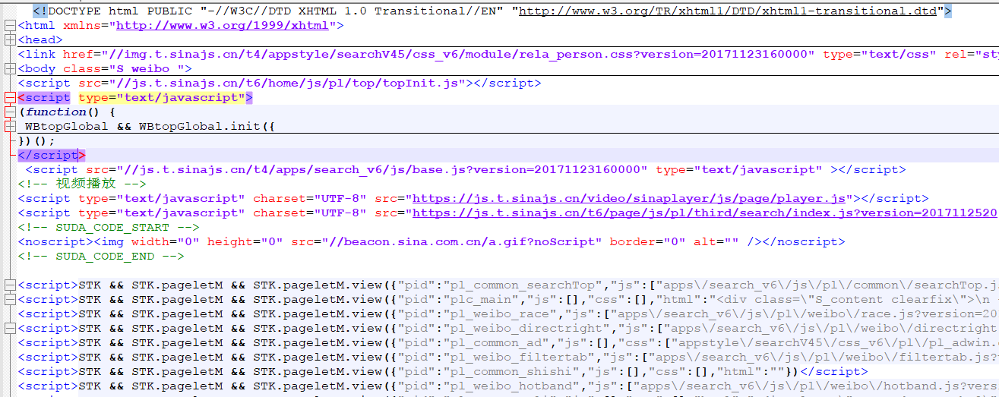

直接请求

```
http://s.weibo.com/weibo/%25E6%25B5%25B7%25E4%25BF%25A1&typeall=1&suball=1&timescope=custom:2017-11-07-0:2017-11-24-0&page=1
```

返回的页面是一个以下文件



这个页面是通过Js动态生成的页面

先读取页面

使用

Python splitlines() 按照行('\r', '\r\n', \n')分隔，返回一个包含各行作为元素的列表

```
<script>STK && STK.pageletM && STK.pageletM.view({"pid":"pl_weibo_direct"'):  
#判断每行字符串以开头，此处是微博详情页面js代码
```

找到字符串中以html":"开头所在索引为n,索引n是字符串,7是html":"这个字符串的长度

```
截取字符串中line[n + 7: -12]

这段字符串结尾是"})</script>长度是12,
所以截止到-12即可
```


